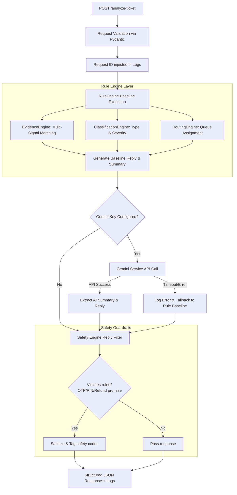

# NovaForge Investigator Backend

A production-ready, clean-architecture FastAPI backend built for the **NovaForge Investigator** hackathon. This system acts as an AI complaint investigator to ingest user complaints, analyze them against user transaction histories, evaluate evidence, categorize and route the case, and draft policy-compliant customer replies.

---

## Folder Structure

```text
├── app/
│   ├── main.py                     # Entry point (CORS, Middleware, Handlers)
│   ├── config.py                   # Environment settings loader
│   ├── routers/
│   │   ├── health.py               # /health GET router
│   │   └── tickets.py              # /analyze-ticket POST router
│   ├── schemas/
│   │   └── ticket.py               # Pydantic validation schemas & Enums
│   ├── services/
│   │   ├── evidence_engine.py      # Multi-signal transaction matching engine
│   │   ├── classification_engine.py# Case type & Severity classifier
│   │   ├── routing_engine.py       # Department routing rules
│   │   ├── safety_engine.py        # Strict content safety filtering
│   │   ├── rule_engine.py          # Deterministic baseline orchestrator
│   │   └── gemini_service.py       # Gemini AI enhancer with fallback logic
│   └── utils/
│       └── logging.py              # Structured logging & Request tracking
├── Dockerfile                      # Production multi-stage Docker build
├── requirements.txt                # System Python dependencies
├── .env.example                    # Template environmental settings
├── .gitignore                      # Git configuration to ignore system cache/secrets
└── README.md                       # Comprehensive guide and architecture document
```

---

## System Architecture

The following diagram illustrates the flow of a ticket through the backend:



---

## Environment Variables

| Variable | Description | Default | Example |
| :--- | :--- | :--- | :--- |
| `PORT` | Container binding port | `8000` | `8000` |
| `ENVIRONMENT` | Run environment type | `production` | `development` |
| `CORS_ORIGINS` | Permitted browser API clients | `*` | `http://localhost:3000` |
| `GEMINI_API_KEY` | Key for Google AI Studio Gemini API | (None) | `AIzaSy...` |

---

## API Documentation

### 1. GET `/health`
Returns system status.
**Response (`200 OK`)**:
```json
{
  "status": "ok"
}
```

### 2. POST `/analyze-ticket`
Evaluates the ticket complaint against transaction histories.

**Request Schema**:
```json
{
  "ticket_id": "TCK-1092",
  "complaint": "I sent 500 Taka to 01712345678 but it failed and the money got cut.",
  "language": "Banglish",
  "channel": "in_app",
  "user_type": "retail_customer",
  "campaign_context": "cashback_2026",
  "transaction_history": [
    {
      "transaction_id": "TXN-9988",
      "timestamp": "2026-06-25T10:00:00Z",
      "type": "transfer",
      "amount": 500.0,
      "counterparty": "01712345678",
      "status": "failed"
    }
  ],
  "metadata": {}
}
```

**Response Schema (`200 OK`)**:
```json
{
  "ticket_id": "TCK-1092",
  "relevant_transaction_id": "TXN-9988",
  "evidence_verdict": "consistent",
  "case_type": "payment_failed",
  "severity": "medium",
  "department": "payments_ops",
  "agent_summary": "Ticket TCK-1092 (Banglish) via in_app. Classified case: payment_failed. Matched Transaction TXN-9988 (Amount: 500.0, Type: transfer, Status: failed, Counterparty: 01712345678). Evidence verdict is consistent.",
  "recommended_next_action": "Initiate standard payment failure investigation. Check upstream network provider status.",
  "customer_reply": "Dear Customer, thank you for reaching out to us. We see that your transaction TXN-9988 for 500.0 has failed. The system will reverse the balance if deducted. We apologize for the inconvenience.",
  "human_review_required": false,
  "confidence": 0.9,
  "reason_codes": [
    "amount_match",
    "counterparty_match",
    "payment_failed",
    "status_match",
    "transaction_match",
    "type_match"
  ]
}
```

---

## Setup & Running Guide

### Local Setup
1. Clone the project and navigate to the project directory:
   ```bash
   python -m venv venv
   # On Windows:
   .\venv\Scripts\Activate.ps1
   # On Linux/macOS:
   source venv/bin/activate
   ```
2. Install dependencies:
   ```bash
   pip install -r requirements.txt
   ```
3. Initialize config:
   ```bash
   cp .env.example .env
   ```
4. Run locally with reload support:
   ```bash
   uvicorn app.main:app --reload --port 8000
   ```
5. Open Swagger docs: http://localhost:8000/docs

---

## Docker Guide

### Build Image
```bash
docker build -t novaforge-backend .
```

### Run Container
```bash
docker run -p 8000:8000 --env-file .env novaforge-backend
```

---

## Testing Guide

Test the API via `curl` command:
```bash
curl -X 'POST' \
  'http://localhost:8000/analyze-ticket' \
  -H 'accept: application/json' \
  -H 'Content-Type: application/json' \
  -d '{
  "ticket_id": "TCK-1",
  "complaint": "I sent 500 to 01711223344 but it failed",
  "language": "en",
  "channel": "email",
  "user_type": "retail_customer",
  "campaign_context": "none",
  "transaction_history": [
    {
      "transaction_id": "TX-100",
      "timestamp": "2026-06-25T12:00:00Z",
      "type": "transfer",
      "amount": 500.0,
      "counterparty": "01711223344",
      "status": "failed"
    }
  ]
}'
```

---

## Known Limitations & Future Improvements
1. **Database Persistence**: Currently stores no ticket logs database-side. To scale, integrate SQLAlchemy or MongoDB.
2. **Advanced NLP**: While the rule engine covers Bangla/Banglish keywords, semantic embedding models (e.g. vertex-AI text-embeddings) would resolve complex syntactic structures before reaching the LLM stage.
3. **Safety Engine Re-prompting**: If Gemini breaches safety rules, the reply is sanitised locally. Future iterations could use Gemini system prompts or agent feedback loop to re-prompt automatically.
